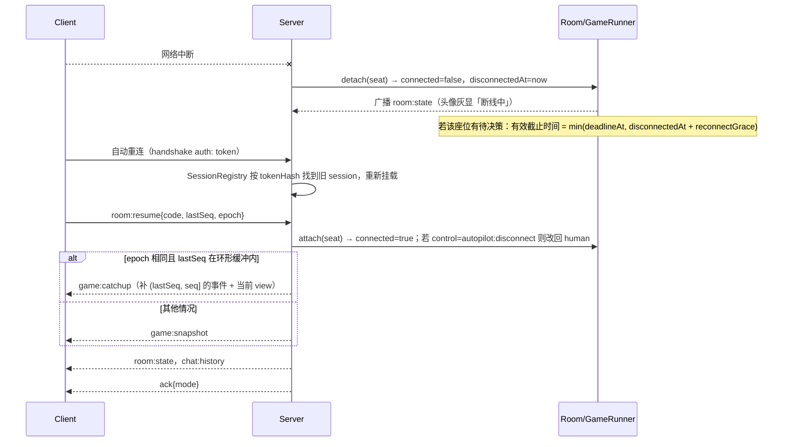
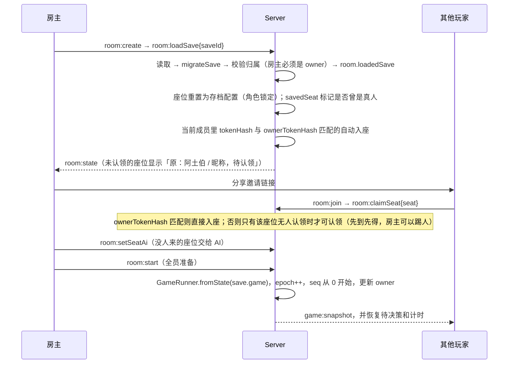

# 大富翁4 Web 复刻：联机与服务端架构设计

> 项目路径：<repo>（目前为空）。本机环境 Node v24.9.0、npm 11.6.0。
> 本设计沿用全局约定：npm workspaces；`packages/shared` 是纯 reducer 引擎；`apps/server` 是权威服务器；`apps/client` 用 Vite。约定里没有要推翻的地方，只对引擎提了几条**契约补充**（见第 12 节），比如待决策要支持数组（拍卖需要多人同时出价）。

---

## 0. 结论速览

| 主题 | 结论 |
|---|---|
| 传输 | **Socket.IO 4.8.x**（服务端和客户端都是 4.8.4）。只用一个 namespace，事件带 TS 类型，请求/响应用 ack。应用层自己实现 `seq/epoch/snapshot` 协议。**不启用** connectionStateRecovery（它只存在内存里，服务器重启就丢）。不用 Colyseus 或 PartyKit |
| HTTP 宿主 | **Fastify 5** 加 `@fastify/static`。一个进程、一个端口，同时托管前端 dist、Socket.IO、健康检查和存档导入导出 API |
| 编排分层 | `RoomManager` → `Room`（大厅状态机，含座位、观战者、房主）→ `GameRunner`（不做 IO 的对局编排：调用引擎、分配序号、管理待决策、计算截止时间、调度 AI）。时钟和定时器都通过注入传入 |
| 同步模型 | 每应用一个 action，就向每类观察者推一个 **batch**：`{seq, cause, events(脱敏), animMs, view(应用后的投影快照), pending, yourDecision?}`。客户端播完 events 后把 `view` 作为最终状态 |
| 身份 | 前端生成 128-bit 随机 token，存在 localStorage；服务端只保存它的 sha256。同一 token 的新连接会顶掉旧连接。重连靠 `room:resume{code,lastSeq,epoch}`，服务端补发缺失事件或直接下发快照 |
| 断线/托管 | 断线后有 15 秒宽限期，之后转 AI 托管（`autopilot:disconnect`），玩家回来自动解除。连续 2 次超时进入 AFK 托管。所有真人都离线时暂停。暂停满 30 分钟自动存档并回收房间 |
| 可见性 | 默认**卡片公开**，还原原版同屏体验，抢夺卡也能看到对方卡片；房间可以改成「只显示张数」。**RNG 状态、牌堆顺序、他人的小游戏种子一律不发给客户端** |
| 小游戏防作弊 | 服务器下发 seed 和 params。客户端跑 shared 里的确定性定帧模拟器，回传输入日志。服务器重放计分，并做时序、频率校验和钳制。超时、托管或电脑玩家都按原版「跳过，得 50–70 点券」处理 |
| AI | 在服务器进程内直接调用 `AiPolicy.decide(公平视图, 决策)`，和真人走同一条 `submit()` 校验管线 |
| 持久化 | **node:sqlite**（Node 内置，没有原生编译依赖）。每个 action 追加一条 journal，每 25 步写一次快照，重启时用「快照 + journal 重放」恢复。存档格式是 gzip(JSON) 加 HMAC 签名，带 `schemaVersion/engineVersion` 和迁移链 |
| 部署 | 单容器单进程（node:24-slim），用 Caddy 自动签 HTTPS/WSS（也可以用 Nginx）。提供 `/healthz` 和 `/readyz`。收到 SIGTERM 后优雅停机并刷盘 |

---

## 1. 传输与框架选型

| 方案 | 优点 | 与「纯 reducer + 服务端权威 + 事件驱动动画」的冲突点 | 2026 维护情况 | 结论 |
|---|---|---|---|---|
| **Colyseus** | 自带房间、匹配、重连（0.17 起客户端自动重连），有 StateView | 核心卖点是 `@colyseus/schema` 可变对象的增量同步，得把不可变的 reducer state 镜像成带装饰器的 Schema 类，等于维护两套状态。0.18 的客户端预测和延迟补偿是给实时动作游戏准备的，回合制用不上。一年里出了 0.16、0.17、0.18 三个有破坏性变更的版本，1.0 还没发，升级成本高 | 活跃（0.18 于 2026-08 发布） | 不用 |
| **PartyKit / partyserver** | 一个房间对应一个 Durable Object，模型很优雅 | 绑定 Cloudflare Workers 运行时，和「Node + 云主机/Docker」的部署要求冲突；用不了 node:sqlite；中国大陆访问 Cloudflare 不稳定 | 活跃（partyserver 0.5.x） | 不用 |
| **ws**（裸 WebSocket） | 最轻、最快，服务端 ws 8.21.x 持续修 CVE | 心跳、指数退避重连、请求响应关联（ack）、房间广播、传输降级都得自己写（约 300–500 行） | 活跃 | 作为备选（有抽象层，可以替换） |
| **Socket.IO 4.8** | 自带 rooms、TS 类型事件、`emitWithAck` 和超时、自动重连、心跳；WebSocket 被公司或校园代理拦截时能退回 HTTP 长轮询（国内网络环境下很实用）；`tryAllTransports` | 协议比裸 ws 多几字节头，回合制完全可以忽略 | 4.8.4（2026-09 仍在发 ws CVE 修复补丁，维护模式但稳定） | **采用** |

采用方式：

- 服务端用 `new Server<C2S, S2C, {}, SocketData>(fastify.server, opts)`，只用默认 namespace `/`。
- 不启用 `connectionStateRecovery`。断线恢复完全由应用层的 `room:resume` 负责，重启后也能用。
- 服务端通过 `RoomBroadcaster`（依赖 Outbox 接口）发消息，`GameRunner` 不直接依赖 Socket.IO，以后换成 ws 只需改 `net/` 目录。
- 推荐的服务端参数：

```ts
new Server(app.server, {
  path: '/socket.io/',
  serveClient: false,
  transports: ['websocket', 'polling'],
  pingInterval: 10_000,          // 默认 25s；调短以便更快发现断线（最坏约 18s）
  pingTimeout: 8_000,
  maxHttpBufferSize: 128 * 1024, // 小游戏输入日志 ≤ 2000 条；存档导入改走 HTTP
  perMessageDeflate: { threshold: 2048 }, // view 快照通常 10–30KB，压缩后约 3–6KB
  httpCompression: { threshold: 2048 },
  cors: cfg.devCorsOrigin ? { origin: cfg.devCorsOrigin } : undefined, // 生产同源，不开 CORS
  allowRequest: (req, cb) => cb(null, originAllowed(req) && connLimiter.tryAcquire(clientIp(req))),
  cleanupEmptyChildNamespaces: true,
});
```

- 客户端参数：`io({ path:'/socket.io/', transports:['websocket','polling'], tryAllTransports:true, reconnectionDelay:500, reconnectionDelayMax:5000, randomizationFactor:0.5, timeout:10000, auth:(cb)=>cb(currentAuth()) })`。`auth` 写成函数，每次重连都会重新取值。

---

## 2. 目录结构（服务端相关部分）

```
rich4/
├─ package.json                  # workspaces: ["packages/*","apps/*"]；scripts: dev/build/test/typecheck/lint
├─ tsconfig.base.json            # strict, module: "esnext", moduleResolution: "bundler", verbatimModuleSyntax
├─ vitest.config.ts              # test.projects: ['packages/shared','apps/server','apps/client']
├─ biome.json
├─ .nvmrc                        # 24
├─ Dockerfile
├─ .dockerignore
├─ deploy/
│  ├─ docker-compose.yml         # app + caddy
│  ├─ Caddyfile
│  └─ nginx.conf.example
├─ packages/shared/              # name: @rich4/shared；exports 直接指向 src/*.ts（不单独构建）
│  └─ src/
│     ├─ engine/ ...             # 规则引擎（其他领域负责）
│     ├─ ai/ ...                 # AiPolicy 实现（其他领域负责；服务器只依赖接口）
│     ├─ net/
│     │  ├─ protocol.ts          # PROTOCOL_VERSION、C2S/S2C 事件表、全部 payload 类型
│     │  ├─ schemas.ts           # 所有 C2S payload 的 zod schema（服务端校验，客户端也可复用）
│     │  ├─ errors.ts            # ErrorCode 与中文默认文案
│     │  ├─ room.ts              # RoomSettings、RoomView、SeatView 类型与默认值
│     │  └─ timing.ts            # 各决策类型超时表、计时档位、宽限常量（客户端显示倒计时要用同一份）
│     ├─ view/
│     │  ├─ project.ts           # projectState / projectEvent / viewerClassKey（按观察者脱敏）
│     │  ├─ privacy.ts           # 事件脱敏表 EVENT_PRIVACY
│     │  └─ pacing.ts            # estimateAnimMs(events)：服务端和客户端共用的动画时长常量
│     ├─ minigames/
│     │  ├─ types.ts             # MinigameSim 接口、InputEvent
│     │  ├─ replay.ts            # replay(sim, seed, params, inputs)
│     │  ├─ balloon/sim.ts       # 七彩气球（射气球）
│     │  ├─ fortune/sim.ts       # 喜从天降（福神赐福）
│     │  └─ penguin/sim.ts       # 企鹅挖宝（冰上挖宝石）
│     ├─ save/
│     │  ├─ format.ts            # SaveFile 类型、SAVE_SCHEMA_VERSION
│     │  └─ migrate.ts           # migrateSave(any) → SaveFileLatest
│     └─ util/prng.ts            # xoshiro128** / mulberry32（可序列化）
└─ apps/server/                  # name: @rich4/server
   ├─ package.json               # scripts: dev = tsx watch src/main.ts；build = node build.mjs（esbuild）
   ├─ build.mjs                  # esbuild：bundle src + @rich4/shared，第三方包保持 external
   ├─ src/
   │  ├─ main.ts                 # 入口：读配置 → 打开 DB → createApp → listen → 注册信号处理
   │  ├─ app.ts                  # createApp(deps) → { listen, close, io, fastify, rooms }（测试直接用它）
   │  ├─ config.ts               # 用 zod 解析环境变量
   │  ├─ http/
   │  │  ├─ static.ts            # @fastify/static + SPA fallback + /r/:code 邀请页（注入 og meta）
   │  │  ├─ health.ts            # /healthz /readyz
   │  │  ├─ saves.ts             # GET /api/saves/:id/export、POST /api/saves/import
   │  │  └─ admin.ts             # GET /admin/stats（需 ADMIN_TOKEN）
   │  ├─ net/
   │  │  ├─ io.ts                # 创建 Socket.IO、握手中间件、注册 handlers
   │  │  ├─ sessions.ts          # SessionRegistry：按 tokenHash 索引，新连接顶替旧连接
   │  │  ├─ guard.ts             # handle(schema, bucket, fn)：限流 → zod 校验 → 调用 → 统一 ack/错误
   │  │  ├─ rateLimit.ts         # 令牌桶（按 socket、IP、事件分组）
   │  │  └─ handlers/{lobby,room,game,chat,saves,time}.ts
   │  ├─ rooms/
   │  │  ├─ RoomManager.ts       # 创建/查找/回收房间、生成房间号、容量控制、启动时恢复
   │  │  ├─ Room.ts              # 大厅状态机、座位、观战者、房主、聊天；持有 GameRunner
   │  │  ├─ RoomBroadcaster.ts   # 按观察者类别投影并分组 emit
   │  │  ├─ roomCode.ts          # 6 位数字房间号（CSPRNG，24h 内不复用）
   │  │  └─ ChatLog.ts           # 环形缓冲 100 条、文本清洗
   │  ├─ game/
   │  │  ├─ GameRunner.ts        # 对局编排核心（不导入任何 node:* 模块）
   │  │  ├─ AiDriver.ts          # AI、托管、超时代决的调度与兜底
   │  │  ├─ Deadlines.ts         # 截止时间 = now + animMs + 超时 × 档位
   │  │  ├─ MinigameReferee.ts   # 小游戏会话、重放、时序与频率校验
   │  │  └─ RingBuffer.ts        # 最近 256 个原始 batch，供补发
   │  ├─ persistence/
   │  │  ├─ db.ts                # 打开 node:sqlite、设置 PRAGMA、迁移建表
   │  │  ├─ SaveRepository.ts    # 接口 + SqliteSaveRepository
   │  │  ├─ RoomStore.ts         # journal 追加、快照写入与加载、列出活跃房间
   │  │  ├─ JsonFileStore.ts     # 备用实现 / 单测
   │  │  └─ codec.ts             # gzip、sha256、HMAC 签名与校验、R4S1 编码
   │  └─ infra/
   │     ├─ clock.ts             # Clock / Scheduler 接口、RealScheduler
   │     ├─ logger.ts            # pino（生产输出 JSON；开发用 pino-pretty）
   │     └─ shutdown.ts          # 优雅停机
   ├─ scripts/
   │  ├─ simulate.ts             # 无 socket，跑 N 局 4 AI 全自动对局（夜间回归 / 模糊测试）
   │  ├─ replay.ts               # 从 DB journal 重放指定房间，输出状态哈希或 diff
   │  └─ loadtest.ts             # N 个房间 × 4 个 bot 客户端压测
   └─ test/
      ├─ helpers/{startTestServer,botClient,manualScheduler,stubEngine}.ts
      ├─ unit/{GameRunner,Deadlines,AiDriver,MinigameReferee,rateLimit,codec,roomCode}.test.ts
      └─ integration/{lobby,full-game-4p,reconnect,spectator-chat,anti-cheat,save-load,restart-recovery}.test.ts
```

补充说明：

- `@rich4/shared` 的 package.json 用 `"exports": { "./net": "./src/net/index.ts", "./view": ..., ".": "./src/index.ts" }`。Vite、tsx、esbuild、vitest 都能直接吃 TS 源码，shared 不需要单独构建。
- `apps/server/src/game/*` **禁止导入 `node:*` 和 socket 相关模块**，靠 lint 规则或自定义 import 检查保证。这样以后可以把它挪进浏览器 Web Worker，做纯离线单机模式。

---

## 3. 房间生命周期

### 3.1 状态机

```
            create                 start
 (none) ─────────► lobby ───────────────────────► playing ◄──────┐
                    ▲  │ loadSave(仍在 lobby，座位锁定为存档配置)  │  │ resume / 有真人回来
                    │  └──────────┐                           │  ▼
                    │ rematch     ▼                           │ paused（host 暂停 或 全员离线）
                  ended ◄──── engine GAME_OVER ◄───────────────┘
 任意状态 ──dissolve(房主) / 闲置 TTL──► closed（playing/paused 时先自动存档）
```

- **创建**：`room:create`。创建者自动成为房主并坐 0 号位。
- **房间号**：6 位数字（100000–999999），用 `crypto.randomInt` 生成，碰撞就重试，24 小时内不复用。手机输入方便，口头也好报。暴力扫号靠限流防：每个 IP 每分钟最多 20 次 `room:join` 失败。
- **邀请链接**：`${PUBLIC_URL}/r/482913`；观战链接加 `?watch=1`。服务端对 `/r/:code` 返回 index.html，并注入 `<title>/<meta property="og:*">`（「邀请你来玩大富翁 · 房间 482913」），方便在 IM 里分享预览。
- **加入**：`room:join{code, role}`。选 player 时自动分到最小的空座位；满了返回 `ROOM_FULL`，前端提示「改为观战？」。游戏中以 player 身份加入会返回 `ROOM_IN_GAME`，除非是认领存档座位或接管被遗弃的座位（见 3.3）。
- **选角色**：`room:selectCharacter`，角色 ID 来自 shared 数据表（原版 12 名角色的致敬版），同房间唯一。AI 座位不选时，开局随机分配剩余角色。
- **准备和开始**：人类玩家 `room:setReady`。房主用 `room:setSeatAi` 给空位补电脑，再 `room:start`。开局条件：参与者（真人 + AI）≥ 2，所有真人已准备，角色不重复。开局时服务器生成 `seed = randomBytes(16)`，调用 `engine.createGame(config, players, seed)`，然后广播 `room:state{phase:'playing'}`，再给每人发 `game:snapshot`。
- **结束**：引擎进入 GAME_OVER 后，房间转为 `ended` 并广播 `game:over`。房间保留 10 分钟，房主可以 `room:rematch` 回到大厅，座位和角色不变、准备状态重置、epoch 加 1。
- **解散和回收**：
  - 大厅：房主 `room:dissolve` 立即关闭；房间里没人 60 秒后回收。
  - 对局中：房主解散前自动存一次档，然后关闭。全员离线则暂停，30 分钟（`ROOM_ABANDON_TTL`）后自动存档并回收。
  - ended：10 分钟后回收。
  - 关闭时向所有成员发 `room:closed{reason}`。
- **房主迁移**：房主在大厅离开时，房主转给座位号最小的真人。对局中房主断线超过宽限期，转给第一个在线真人。也可以 `room:transferHost` 手动转。房主权限包括：改设置、补/撤 AI、踢人、开始、暂停、存档、读档、解散。

### 3.2 座位与观战者

```ts
interface SeatSlot {                   // 服务器内部结构（不直接下发）
  index: SeatIndex;                    // 0..3，即回合顺序（原版 1P→4P）
  occupant: null
    | { kind: 'human'; tokenHash: string; nickname: string; socketId: string | null }
    | { kind: 'ai'; difficulty: AiDifficulty; name: string };
  characterId: CharacterId | null;
  ready: boolean;
  control: SeatControl;                // 见 5.3
  consecutiveTimeouts: number;
  disconnectedAt: number | null;
  savedSeat?: SaveSeat;                // 读档后等待认领
}
```

- 观战者 `Map<spectatorId, {tokenHash, nickname, socketId}>`。上限由 `settings.maxSpectators` 决定（默认 10，最大 20）。`settings.allowSpectators=false` 时拒绝，返回 `SPECTATORS_DISABLED`。
- 大厅里可以互相切换：`room:takeSeat{seat}`（观战者坐下）和 `room:toSpectator`（玩家起身）。
- 同一个 token 同一时间只能在一个房间里。加入新房间前，如果原房间在大厅，会自动离开；如果原房间正在对局，返回 `ALREADY_IN_ROOM`，需要先 `room:leave`。

### 3.3 对局中离开与接管

- `room:leave`（对局中）：座位 control 变为 `autopilot:left`，但 tokenHash 保留，同一 token 之后 `room:resume` 可以拿回座位。
- 房主 `room:kick{seat}`：清除该座位的 tokenHash，座位变成纯 AI（`control='ai'`），被踢者收到 `room:closed{reason:'kicked'}`。
- 可选功能：房主可以对 `autopilot:left` 或纯 AI 座位发 `room:assignSeat{seat, spectatorId}`，把座位交给某个观战者接管（原座位数据不变，只换 tokenHash 和昵称）。

---

## 4. 消息协议

### 4.1 通用约定

- 全部消息是 Socket.IO 带类型的事件。C2S（客户端到服务端）一律带 ack，返回 `Result<T>`。S2C（服务端到客户端）是单向推送。
- 服务端**先广播 batch，再调用 ack**。客户端以 batch 为准更新状态，ack 只用来处理错误和关闭 loading。
- `seq`：房间内单调递增，每应用一个 action 加 1。`epoch`：开局、读档、重启恢复、rematch 时加 1，epoch 变了说明序号连续性断了，客户端必须拿快照。
- 客户端规则：
  1. 收到 batch 时，如果 epoch 和本地不同，或 `seq !== lastSeq + 1`，丢弃并发 `game:resync`。
  2. `seq <= lastSeq` 的 batch 视为重复，直接忽略。
  3. 连上以后，只要本地记着房间，就发 `room:resume`。
- 事件名 `error` 是 Socket.IO 保留名，异步错误改用 `app:error`。
- 所有 C2S payload 在 shared 里都有对应的 zod schema，服务端 `guard.ts` 统一做 `safeParse`，失败返回 `BAD_REQUEST`。

### 4.2 基础类型（`packages/shared/src/net/protocol.ts`）

```ts
export const PROTOCOL_VERSION = 1 as const;

export type SeatIndex = 0 | 1 | 2 | 3;
export type AiDifficulty = 'easy' | 'normal' | 'hard';
export type RoomPhase = 'lobby' | 'playing' | 'paused' | 'ended';
export type SeatControl =
  | 'human' | 'ai'
  | 'autopilot:manual' | 'autopilot:afk' | 'autopilot:disconnect' | 'autopilot:left';
export type ActorBy = 'player' | 'ai' | 'autopilot' | 'timeout' | 'system';

export type ErrorCode =
  | 'BAD_HANDSHAKE' | 'PROTOCOL_MISMATCH' | 'BAD_REQUEST' | 'RATE_LIMITED' | 'SERVER_BUSY' | 'INTERNAL'
  | 'ROOM_NOT_FOUND' | 'ROOM_FULL' | 'ROOM_IN_GAME' | 'ALREADY_IN_ROOM' | 'NOT_IN_ROOM'
  | 'NOT_HOST' | 'NOT_A_PLAYER' | 'SEAT_TAKEN' | 'CHARACTER_TAKEN'
  | 'NOT_ALL_READY' | 'NOT_ENOUGH_PLAYERS' | 'SPECTATORS_DISABLED'
  | 'GAME_PAUSED' | 'NOT_YOUR_DECISION' | 'STALE_DECISION' | 'INVALID_ACTION'
  | 'MINIGAME_INVALID' | 'MINIGAME_TOO_EARLY' | 'MINIGAME_TOO_LATE'
  | 'SAVE_NOT_FOUND' | 'SAVE_INCOMPATIBLE' | 'SAVE_FORBIDDEN' | 'CHAT_DISABLED';

export interface AppError { code: ErrorCode; message: string; details?: unknown }
export type Result<T = void> = { ok: true; data: T } | { ok: false; error: AppError };
export type Ack<T = void> = (res: Result<T>) => void;

/** Socket.IO 握手 auth（客户端 auth 回调每次重连都会重新取值） */
export interface HandshakeAuth {
  token: string;            // /^[A-Za-z0-9_-]{22,64}$/，前端生成：16 字节 CSPRNG 转 base64url
  nickname: string;         // 1..12 字，NFC 规范化，去掉控制字符和零宽字符
  protocolVersion: number;  // 与 PROTOCOL_VERSION 不一致 → connect_error{data:{code:'PROTOCOL_MISMATCH'}}，前端提示刷新
  clientVersion: string;    // 构建号，只用于日志
}
```

### 4.3 房间与视图类型（`net/room.ts`）

```ts
export interface RoomSettings {
  visibility: 'private' | 'public';          // public 会出现在大厅列表里
  allowSpectators: boolean;                   // 默认 true
  maxSpectators: number;                      // 0..20，默认 10
  spectatorChat: 'all' | 'spectators' | 'off';// 默认 all（观战者只能看到公开信息，泄密风险低）
  handVisibility: 'public' | 'private';       // 默认 public（还原原版同屏体验）；开局时真人座位 ≥ 2 锁定为 private（§6.1）
  timerPreset: 'fast' | 'normal' | 'slow' | 'off'; // 只有一名真人时实际不计时（RoomView.effectiveTimerPreset，§5.4）
  timeoutPolicy: 'ai' | 'default';            // 超时由 AI 代决（默认）或执行决策的 defaultIntent
  reconnectGraceSec: number;                  // 默认 15
  pauseWhenAllAway: boolean;                  // 默认 true
  aiPace: 'normal' | 'fast';
  game: GameConfig;                           // 引擎定义：地图、起始资金/点券、胜利条件、天数上限……
}

export interface SeatView {
  index: SeatIndex;
  occupant: null
    | { kind: 'human'; nickname: string; connected: boolean; ready: boolean; isYou: boolean }
    | { kind: 'ai'; difficulty: AiDifficulty; name: string };
  characterId: CharacterId | null;
  control: SeatControl;
  isHost: boolean;
  savedSeat?: { nickname: string; characterId: CharacterId; wasHuman: boolean; claimableByYou: boolean };
}

export interface RoomView {
  code: string;
  inviteUrl: string;
  phase: RoomPhase;
  epoch: number;
  seats: [SeatView, SeatView, SeatView, SeatView];
  spectators: { id: string; nickname: string }[];
  settings: RoomSettings;
  effectiveTimerPreset?: TimerPreset;         // 有效计时档位（§5.4）：真人座位 ≤ 1 时为 off；大厅按座位上的真人推算
  you: { role: 'player'; seat: SeatIndex; isHost: boolean } | { role: 'spectator'; id: string; isHost: false };
  loadedSave?: { saveId: string; name: string; gameDay: number; verified: boolean };
  paused?: { reason: 'host' | 'all_away'; since: number };
  serverNow: number;
}

export interface PublicRoomSummary {
  code: string; hostName: string; phase: RoomPhase; mapId: string;
  humans: number; ais: number; spectators: number; allowSpectators: boolean; createdAt: number;
}
```

### 4.4 对局消息类型

```ts
/** 所有观察者都能看到的待决策信息（例如「阿土伯 思考中 12s」） */
export interface PendingView {
  decisionId: string;
  seat: SeatIndex;
  kind: DecisionKind;                    // 引擎定义
  deadlineAt: number | null;             // 服务器时间戳（ms）；null 表示不限时
  control: SeatControl;
  publicInfo?: DecisionPublicInfo;       // 例如「正在考虑是否购买 台北 101」
}

/** 只发给做决策的那位玩家 */
export interface DecisionForYou {
  decisionId: string;
  kind: DecisionKind;
  options: DecisionOptions;              // 可能含私密信息（例如抢夺卡里对手的卡片）
  deadlineAt: number | null;
  minigame?: MinigameTicket;
}

export interface MinigameTicket {
  sessionId: string;
  minigameId: MinigameId;                // 'balloon' | 'fortune' | 'penguin'
  seed: number;                          // uint32
  params: unknown;                       // 例如难度、时长
  tickHz: 60;
  durationTicks: number;
  startsAt: number;                      // 服务器时间，包含 3 秒倒计时
}

export interface BatchCause { seat: SeatIndex | null; intentType: string; by: ActorBy }

export interface GameBatchMsg {
  epoch: number;
  seq: number;
  cause: BatchCause;
  events: GameEvent[];                   // 已按观察者脱敏
  animMs: number;                        // estimateAnimMs(events)，服务端和客户端共用常量
  view: GameView;                        // 应用 action 之后，按观察者投影的完整快照
  pending: PendingView[];
  yourDecision?: DecisionForYou;
  serverNow: number;
}

export interface GameSnapshotMsg {
  epoch: number; seq: number;
  view: GameView;
  pending: PendingView[];
  yourDecision?: DecisionForYou;
  serverNow: number;
}

export interface GameCatchupMsg {        // 短暂断线后的补发：只补 events，最后带一份当前 view
  epoch: number;
  batches: Array<Pick<GameBatchMsg, 'seq' | 'cause' | 'events' | 'animMs'>>;
  view: GameView; seq: number;
  pending: PendingView[]; yourDecision?: DecisionForYou;
  serverNow: number;
}

export interface PendingChangedMsg {     // 截止时间或托管状态变了，但没有新的 action（暂停、恢复、重连、切换托管）
  epoch: number; seq: number;
  pending: PendingView[]; yourDecision?: DecisionForYou; serverNow: number;
}

export interface MinigameSubmission {
  sessionId: string;
  minigameId: MinigameId;
  inputs: Array<[tick: number, code: number, a?: number, b?: number]>; // 最多 2000 条，tick 单调不减
  claimedScore: number;
  clientElapsedMs: number;
}

export interface GameOverMsg { epoch: number; result: GameResult; ranking: Array<{ seat: SeatIndex; netWorth: number }> }

export type ChatSender =
  | { kind: 'seat'; seat: SeatIndex; nickname: string }
  | { kind: 'spectator'; id: string; nickname: string }
  | { kind: 'system' };

export interface ChatMessage {
  id: string; ts: number; from: ChatSender;
  text?: string;                                               // 真人消息
  system?: { key: SystemMsgKey; params: Record<string, string | number> }; // 系统消息，前端做本地化
  audience: 'all' | 'spectators';
}

export interface EmoteMsg { id: string; ts: number; from: ChatSender; emoteId: string; targetSeat?: SeatIndex }

export interface SaveSummary {
  saveId: string; name: string; kind: 'manual' | 'auto'; mapId: string; gameDay: number;
  seats: Array<{ characterId: CharacterId; nickname: string; wasHuman: boolean }>;
  createdAt: number; compatible: boolean;
}
```

### 4.5 C2S 事件表

```ts
export interface ClientToServerEvents {
  // 大厅
  'lobby:list':          (p: {}, ack: Ack<{ rooms: PublicRoomSummary[] }>) => void;
  // 房间
  'room:create':         (p: { settings?: Partial<RoomSettingsInput> }, ack: Ack<{ code: string; inviteUrl: string }>) => void;
  'room:join':           (p: { code: string; role: 'player' | 'spectator' }, ack: Ack<{ you: RoomView['you'] }>) => void;
  'room:resume':         (p: { code: string; lastSeq: number; epoch: number }, ack: Ack<{ mode: 'lobby' | 'events' | 'snapshot' }>) => void;
  'room:leave':          (p: {}, ack: Ack) => void;
  'room:dissolve':       (p: {}, ack: Ack) => void;                                    // 仅房主
  'room:updateSettings': (p: { patch: Partial<RoomSettingsInput> }, ack: Ack) => void; // 仅房主，仅大厅阶段
  'room:takeSeat':       (p: { seat: SeatIndex }, ack: Ack) => void;
  'room:toSpectator':    (p: {}, ack: Ack) => void;
  'room:selectCharacter':(p: { characterId: CharacterId }, ack: Ack) => void;
  'room:setReady':       (p: { ready: boolean }, ack: Ack) => void;
  'room:setSeatAi':      (p: { seat: SeatIndex; ai: { difficulty: AiDifficulty } | null }, ack: Ack) => void; // 仅房主
  'room:kick':           (p: { target: { seat: SeatIndex } | { spectatorId: string } }, ack: Ack) => void;
  'room:transferHost':   (p: { seat: SeatIndex }, ack: Ack) => void;
  'room:assignSeat':     (p: { seat: SeatIndex; spectatorId: string }, ack: Ack) => void; // 可选功能
  'room:start':          (p: {}, ack: Ack) => void;
  'room:rematch':        (p: {}, ack: Ack) => void;
  'room:loadSave':       (p: { saveId: string }, ack: Ack) => void;                    // 仅房主，仅大厅阶段
  'room:claimSeat':      (p: { seat: SeatIndex }, ack: Ack) => void;                   // 认领读档后的座位
  // 对局
  'game:act':            (p: { decisionId: string; intent: PlayerIntent; clientActionId: string }, ack: Ack<{ seq: number }>) => void;
  'game:minigameSubmit': (p: MinigameSubmission, ack: Ack<{ score: number }>) => void;
  'game:autopilot':      (p: { on: boolean }, ack: Ack) => void;                       // 手动托管开关
  'game:pause':          (p: { paused: boolean }, ack: Ack) => void;                   // 仅房主
  'game:resync':         (p: {}, ack: Ack) => void;                                    // 服务端回推 game:snapshot
  'game:save':           (p: { name: string }, ack: Ack<{ saveId: string }>) => void;  // 仅房主
  // 存档
  'saves:list':          (p: {}, ack: Ack<{ saves: SaveSummary[] }>) => void;
  'saves:delete':        (p: { saveId: string }, ack: Ack) => void;
  // 社交
  'chat:send':           (p: { text: string }, ack: Ack) => void;                      // 1..200 字
  'chat:emote':          (p: { emoteId: string; targetSeat?: SeatIndex }, ack: Ack) => void;
  // 时钟
  'time:ping':           (p: { t0: number }, ack: Ack<{ t0: number; serverNow: number }>) => void;
}
```

### 4.6 S2C 事件表

```ts
export interface ServerToClientEvents {
  'room:state':       (v: RoomView) => void;          // 房间任何变化都发全量（通常小于 2KB）
  'room:closed':      (p: { reason: 'dissolved' | 'kicked' | 'idle' | 'server' }) => void;
  'game:snapshot':    (p: GameSnapshotMsg) => void;
  'game:batch':       (p: GameBatchMsg) => void;
  'game:catchup':     (p: GameCatchupMsg) => void;
  'game:pending':     (p: PendingChangedMsg) => void;
  'game:over':        (p: GameOverMsg) => void;
  'chat:message':     (m: ChatMessage) => void;
  'chat:history':     (p: { messages: ChatMessage[] }) => void; // 加入或恢复时发送
  'chat:emote':       (e: EmoteMsg) => void;
  'session:replaced': (p: {}) => void;                          // 同一 token 在别处登录
  'server:notice':    (p: { kind: 'shutdown' | 'maintenance' | 'info'; message: string; reconnectInMs?: number }) => void;
  'app:error':        (e: AppError) => void;                    // 与请求无关的异步错误
}
```

### 4.7 心跳与时钟

- 连接存活由 Socket.IO 心跳负责（服务端每 10 秒 ping，8 秒超时）。标签页直接关闭时会立刻收到 close 帧；静默断网最坏约 18 秒才能发现。
- 时钟同步：客户端每 15 秒发 `time:ping`，用 `offset = serverNow + rtt/2 - Date.now()` 算偏差，取最近 5 次的中位数。倒计时显示 `deadlineAt - (Date.now() + offset)`。每个 batch 也带 `serverNow`，作为粗校准。
- 客户端监听 `visibilitychange`，页面重新可见时如果发现掉线或落后，就触发 resync（移动端后台会被挂起）。

### 4.8 限流与大小限制（`net/rateLimit.ts`，令牌桶）

| 分组 | 额度 |
|---|---|
| `game:act` | 每秒 10 个，突发 20 |
| `game:minigameSubmit` | 每 2 秒 1 个 |
| `chat:send` | 每 10 秒 5 条；文本 ≤ 200 字 |
| `chat:emote` | 每 1.5 秒 1 个 |
| `room:*` 和 `lobby:*` | 每 10 秒 20 个 |
| `room:join` 失败 | 每 IP 每分钟 20 次（防扫房间号） |
| `room:create` | 每 IP 每分钟 5 次；同一 token 同时只能有 1 个活跃房间 |
| `time:ping` | 每秒 2 个 |

其他限制：同一 IP 最多 30 个并发连接；全服最多 `MAX_ROOMS` 个房间（默认 500）；堆内存超过 80% 时拒绝建房，返回 `SERVER_BUSY`；单条消息 ≤ 128KB。

---

## 5. 身份、断线重连与回合计时

### 5.1 身份

- 前端首次访问时生成 `token = base64url(crypto.getRandomValues(new Uint8Array(16)))`。这里**不用** `crypto.randomUUID`，因为用局域网 http 地址访问时不是安全上下文，这个 API 不可用。token 存在 `localStorage['rich4.token']`，昵称存在 `rich4.nickname`，上次所在房间存在 `rich4.lastRoom = {code, epoch, lastSeq}`。
- 服务端只处理 `tokenHash = sha256(token)`（hex）。数据库、存档、日志里都只出现 hash。token 永远不回显，也不广播。对外公开的只有座位号、昵称和观战者 id（每次连接随机生成）。
- 同一 tokenHash 已有在线 session 时，给旧 socket 发 `session:replaced` 并断开，新 session 接管旧 session 的 roomCode、角色和座位。
- 「设备迁移码」：设置页可以显示和输入 token，用来在另一台设备恢复身份和存档，页面上提示不要泄露给别人。数据清掉以后，可以用导出的存档文件找回对局。
- 以后如果接入账号系统，只要把 tokenHash 映射到 userId，协议不用改。

### 5.2 重连流程



- 环形缓冲保存最近 256 个**原始** batch（`{seq, cause, rawEvents, animMs}`）。补发时按观察者实时脱敏，只在最后附一份当前 view，所以缓冲里不需要存每步的 view。
- 客户端补发策略：落后 ≤ 8 个 batch 时用 2–4 倍速播放；超过就跳过动画，直接应用 view。
- 刷新页面：前端从 localStorage 读出 lastRoom，发 `room:resume`。如果房间已经不在了，返回 `ROOM_NOT_FOUND`，前端回到首页，并在「我的存档」里显示这局的自动存档。

### 5.3 托管状态机（`SeatControl`）

| 触发 | 变化 | 解除 |
|---|---|---|
| 断线超过 `reconnectGraceSec`（默认 15 秒） | `human → autopilot:disconnect` | 重连后自动解除 |
| 连续 2 次决策超时（在线但没操作） | `human → autopilot:afk`，发系统消息 | 玩家任意一次 `game:act` 或 `game:autopilot{on:false}` |
| 玩家主动托管（对应原版的「自动运行」） | `human → autopilot:manual` | `game:autopilot{on:false}`，或玩家主动做了一次决策 |
| 对局中 `room:leave` | `→ autopilot:left` | 同一 token 执行 `room:resume` |
| 被踢，或本来就是 AI | `ai` | 不可解除 |

解除托管时，如果该座位当前有待决策且 AI 定时器还没触发，就取消 AI 定时器，给玩家一个新截止时间：`deadlineAt = now + max(剩余时间, 10s)`，然后发 `game:pending`。

### 5.4 回合计时器（`game/Deadlines.ts` + `shared/net/timing.ts`）

- 引擎是纯函数，**时间不进入引擎状态**。计时器完全在服务端这一层。
- 截止时间 = `now + animMs × animScale + timeout(kind) × presetScale`。服务端定时器在 `deadlineAt + 800ms`（网络宽限）才真正触发。这样**动画时间不会占用玩家的思考时间**。
- 默认超时（normal 档，单位秒）。fast 档 × 0.5，slow 档 × 2，off 档不限时（但断线托管照常生效）：

| DecisionKind（由引擎定义，下表是建议值） | 秒 |
|---|---|
| TURN_MENU（用卡、股票、掷骰） | 30 |
| BUY_LAND / UPGRADE / CONFIRM | 15 |
| CHOOSE_PATH（岔路选方向） | 10 |
| PICK_TARGET（卡片或神仙的目标） | 20 |
| SHOP（百货公司、道具店） | 30 |
| STOCK_PANEL（第一次打开股市面板时额外加时） | +30（只加一次） |
| AUCTION_BID（多人同时出价，每人独立计时） | 15 |
| LOTTERY_PICK（乐透选号） | 15 |
| MINIGAME | 小游戏时长 + 5 |
| 其他 | 20 |

- **有效计时档位**（`shared/net/timing.ts` 的 `effectiveTimerPreset` / `isHumanSeatControl`，`GameRunner.effectiveTimerPreset()`）：
  截止时间按它计算，而不是直接按 `settings.timerPreset`。规则：房间设置的档位，但**真人座位 ≤ 1 时为 off**——只有一名真人、
  其余都是电脑的房间和单机（`/solo` 本来就是 off）一样不限时。真人座位按座位控制方式数：`human` 与各种托管
  （`autopilot:manual` / `afk` / `disconnect`，本人还在这局里）都算；电脑补位与被踢（`ai`）、对局中离开（`autopilot:left`）不算；
  **已淘汰（破产或投降，引擎里 `players[].alive` 为 false）的真人不算**——不管控制方式是什么（出局后仍在线观看、关掉页面转断线
  托管都一样），他已经没有决策了；观战者不占座位，不影响判定。房间设置本身不变（多名真人时仍按设置），`room:state` 的 `RoomView.effectiveTimerPreset` 下发
  判定结果（大厅里按座位上的真人数推算，开局就按它计时），大厅与建房的计时设置下有一行说明「只有一名真人时不计时」。
  - 开局（含读档开局、重启恢复）时按各座位的初始控制方式判定：读档后未认领、由电脑补上的真人座位是 `ai`，不算真人；
    重启恢复沿用快照里的控制方式（离开的仍是 `autopilot:left`）。存档与快照不另存判定结果，读档时总是重新推导。
  - 对局中控制方式变化或对局进展使结果改变时（有人离开 / 被踢 / 破产 / 投降后只剩一名真人；离开的人同一 token 回来又变成
    两名真人）重新计算当前待决策的截止时间（`GameRunner.retime`；淘汰在 `apply` 里提交新状态后比较前后结果）：变为不限时 → 取消截止时间与超时定时器、清掉 TURN_MENU 计时链；变为有时限 →
    从现在（这批动画还没播完则从播完时）起按档位给完整时限，计时链从头开始。小游戏窗口不受影响；电脑 / 托管代打的决策
    只改截止时间，AI 定时器不动。结果走现有通道下发：离开、回来经 `game:pending`，踢人随 `SYS_SET_CONTROLLER` 那一批的
    `game:batch`，淘汰随出局那一批的 `game:batch`（这一批之后新出现的决策直接按新结果计时）；`room:state` 同时带新的
    `effectiveTimerPreset`（淘汰经 `RunnerHooks.timerPresetChanged` 通知房间，先于这一批广播）。引擎状态里没有墙钟时间，这只是调度层的事，不影响确定性。
  - 与决策计时无关的机制不变：只剩的那名真人断线时照断线宽限转 `autopilot:disconnect`（宽限期内给别人看的截止时间是
    宽限结束，同单机），全员离线按 `pauseWhenAllAway` 暂停；超时进 AFK 托管只在有截止时间时才会发生。
- 超时处理：先确认 `decisionId` 仍然有效。`timeoutPolicy='ai'` 时调用 `AiDriver` 代决（`by:'timeout'`）；为 `'default'` 时执行 `decision.defaultIntent`。之后该座位 `consecutiveTimeouts++`，达到 2 次进入 `autopilot:afk`。
- 暂停（房主手动或全员离线）：记下每个待决策的剩余时间 `remainingMs = deadlineAt - now`，然后取消所有定时器。恢复时 `deadlineAt = now + max(remainingMs, 5000)`，并广播 `game:pending`。
- 竞态：真人提交和超时同时到达时，Node 单线程保证先执行的那个生效，后到的返回 `STALE_DECISION`，前端提示「已超时，电脑代为决定」。

---

## 6. 状态可见性与防作弊

### 6.1 投影（`shared/view/project.ts`）

```ts
export type Viewer = { kind: 'seat'; seat: SeatIndex } | { kind: 'spectator' };
export interface VisibilityOptions { handVisibility: 'public' | 'private' }

export function projectState(s: GameState, v: Viewer, o: VisibilityOptions): GameView;
export function projectEvent(e: GameEvent, v: Viewer, o: VisibilityOptions): GameEvent | null; // 返回 null 表示对该观察者不可见
export function viewerClassKey(v: Viewer, o: VisibilityOptions): string; // public 模式下所有人都是 'public'，投影只算一次
```

- **向引擎提出的契约**：所有只能留在服务端的数据集中放在 `state.secret`，包括 `rng`、各牌堆（命运、机会、新闻）的顺序、未来的小游戏种子等。这样 `projectState` 的第一步就是 `const { secret, ...pub } = state`，再把牌堆换成 `{ remaining: number }`。这种结构很难误泄露。
- **手牌可见性**：原版是单机同屏轮流玩，「查看人物资料」能看到别人的资产和道具；抢夺卡使用时可以先看对手的道具和卡片再挑。单机与「1 名真人 + 电脑」默认 `public`，还原原版。**联机（座位上真人 ≥ 2）时服务器在开局（含读档开局）的 `Room.launch` 里按 `net/room.ts effectiveHandVisibility` 把房间设置锁定为 `private`**（用户要求「联机时禁止对手查看自己手上的道具与卡片」），随房间快照与存档保存，只会从公开改为私密；重启恢复（`Room.restore`）时按座位上的真人占用（不按 control：对局中离开的真人是 `autopilot:left`）再锁定一次，私密锁定上线前开局、快照里还是 public 的联机对局恢复后也改为私密。私密模式下对手与观战者：
  - `PlayerView.cards` / `items` 为 null，只有 `cardCount` / `itemCount`（原版资产表本来就显示「卡片 N / 道具 N」，得失数量本来公开）；正在骑的交通工具、点券照常公开；
  - `GameView.pools` 为 null、`post.pools` 去掉：牌堆与共享道具库存每批前后的张数差能精确推出别人摸到、买到了什么；
    本人决策里同源的数也不下发：`GameRunner.decisionFor` 经 `view/project.ts projectDecisionOptions` 把 `SHOP.items[].pool`
    改成只有 0 / 1（有没有货），否则进店的人拿 10 减去自己的持有数与剩余数就能推出别人手上道具 1..8 的数量；
  - 别人的 `hostility`（敌意值）只留「对观察者本人」那一项、其余为 0，观战者全为 0（`view/project.ts hideHostility`，`post.players[].set.hostility` 同样改写）：抢夺卡结算时被抢人对出卡人的敌意正好加上被抢卡片 / 道具的标价，第三方看得到增量就能按价格反推出被抢的种类。别人对本人的敌意只因本人自己的动作增加（金额本人都知道）、因公开的同盟衰减与破产清零减少，所以保留。客户端「被最敌视的对手收过路费时说『我记住你了』」（`audio/cues.ts rivalOf`）只在付钱的本人那边判定，其他人听按金额分档的台词；电脑策略只读自己的敌意，不受影响；
  - 抢夺卡、命运「生日」照样可用：对手的卡片与道具清单只通过 `DecisionForYou.options` 发给出卡人一个人（原版真人出抢夺卡时先看清单、可以取消）。
- 事件脱敏（`EVENT_META[type].privacy === 'redactHand'`，逐类规则在 `view/project.ts HAND_REDACTORS`）：`CARD_GAINED` / `CARD_LOST` 的 `card`、`SHOP_TRADE` / `CHAIRMAN_GIFT` 的 `card` 与 `item`、`ITEM_GAINED` / `ITEM_LOST` 的 `item` 对 seat 以外的人置 null（数量、来源保留）；`SHOP_OPENED.shelf` 只给进店的人；`CARD_USED` 公开，只有抢夺卡抢道具时 `target.take.item` 只给出卡人与被抢人。`ITEM_USED`、`PASSIVE`、`RESEARCH_DONE`、公布栏挂牌公开（原版当众发生）。`post.players[].set.cards` / `items` 按同样规则改写。泄漏扫描 `view/handLeaks.ts findHandLeaks` 供测试深度扫描 S2C 载荷（含别人的 `hostility`）。
- 电脑：`GameRunner.aiAct` 对电脑座位（control='ai'）用 public 投影（原版电脑与玩家同一进程、直接读内存），真人座位的托管与超时代打按房间设置降级。
- 观战者永远只能拿到 `{kind:'spectator'}` 的公开投影，看不到任何人的 `DecisionForYou`。
- 发送分组：`RoomBroadcaster` 把 payload 按 `(viewerClassKey, 是否为决策者)` 分组，然后 `io.to(socketIds).emit(...)`。public 模式下一个 batch 只需序列化 2–5 次。

### 6.2 action 校验管线（`handlers/game.ts` → `GameRunner.submit`）

1. 限流。
2. 用 zod 校验 `{decisionId, intent, clientActionId}`。`intent` 用引擎导出的 `PlayerIntentSchema`，它是 discriminated union，**不包含**只有服务端能产生的 intent，例如 `MINIGAME_RESULT`。
3. session 必须在房间里，并且是 player 身份；**seat 只从 session 取，payload 里不带 seat**。
4. `room.phase==='playing'`，否则返回 `GAME_PAUSED`。
5. 幂等：每个座位用 LRU 记住最近 32 个 `clientActionId`，重复提交直接返回上次的结果。
6. 必须存在 `id === decisionId && seat === session.seat` 的待决策，否则返回 `STALE_DECISION` 或 `NOT_YOUR_DECISION`。
7. `intent.type ∈ allowedIntents(decision.kind)`（shared 里的表），否则返回 `INVALID_ACTION`。
8. 如果当前是 `autopilot:*`，先解除托管（真人操作优先）。
9. `engine.applyAction(state, {...intent, seat, decisionId})` 放在 try/catch 里。抛 `EngineRuleError` 返回 `INVALID_ACTION{rule}`；其他异常返回 `INTERNAL`，同时把 journal 导出到 `DATA_DIR/crash/` 方便复现。因为 reducer 不可变，旧 state 不受影响。
10. 提交：`seq++`，追加 journal，写环形缓冲，重新计算待决策和定时器，广播 batch，最后 ack。

同一个房间的所有处理都在 Node 单线程里同步执行（引擎是同步的），不会有并发写。

其他防护：

- 骰子和所有随机数只在服务器生成。客户端的骰子动画只是播放事件里的点数；遥控骰子卡通过决策选项实现。
- 快照绝不包含 `secret`。测试会深度扫描所有 S2C 输出，断言不出现 `secret`、`rng`、牌堆顺序这些键。
- 存档导入要校验 HMAC。签名无效的存档仍然可以读，但所有人都会在大厅看到「非官方存档」标记。

### 6.3 小游戏裁判（`MinigameReferee.ts` + `shared/minigames/*`）

原版一共三个小游戏：七彩气球、喜从天降（福神赐福）、企鹅挖宝（冰上挖宝石）。电脑玩家到达时会跳过，直接得 50–70 点券。

```ts
// shared/minigames/types.ts
export type InputEvent = readonly [tick: number, code: number, a?: number, b?: number];
export interface MinigameSim<P, S> {
  id: MinigameId;
  tickHz: 60;
  durationTicks(p: P): number;
  maxScore(p: P): number;
  maxInputsPerSecond: number;              // 例如射气球 8 次/秒
  validateInput(e: InputEvent, p: P): boolean;  // 坐标、按键范围
  init(seed: number, p: P): S;
  step(s: S, inputsThisTick: readonly InputEvent[]): S;
  isOver(s: S): boolean;                   // 例如挖到炸弹、被炸到
  score(s: S): number;
}
export function replay<P, S>(sim: MinigameSim<P, S>, seed: number, p: P, inputs: readonly InputEvent[]): { score: number; endTick: number };
```

- **确定性要求**：
  - 定帧 60Hz；只用整数或定点数运算。
  - 不用 `Math.random`、`Date`，也不用 `Math.sin/cos/pow` 这类跨引擎结果可能不一致的函数，需要时用数据表查表。
  - 随机数只来自 shared 的 PRNG。
  - 客户端渲染也用同一个 sim，加插值，保证玩家看到的就是服务器算出来的结果。
- **流程**：
  1. 引擎进入 `MINIGAME` 决策时，从 `secret.rng` 派生出 seed，放进 decision 里。
  2. Referee 开启会话，`startsAt = now + animMs + 3000`，把 `MinigameTicket` 只发给该玩家；其他人收到 `MINIGAME_STARTED{seat, minigameId}`，显示「等待 X 进行小游戏」。
  3. 客户端玩完，发 `game:minigameSubmit`。
- **服务端校验**：
  - 会话处于 open 状态，seat 和 minigameId 匹配。
  - `inputs.length ≤ 2000`，tick 是整数、单调不减、落在 `[0, durationTicks]` 内，每条都通过 `validateInput`，任意 1 秒窗口内的输入密度不超过 `maxInputsPerSecond`。
  - 时序：`now - startsAt ≥ (endTick / 60) × 1000 × 0.85 - 500` 且 `now ≤ startsAt + durationMs + 5000`。提交太早返回 `MINIGAME_TOO_EARLY`；太晚按超时处理。
  - 用重放算出服务器分数 `score = clamp(replay(...), 0, maxScore)`。如果客户端报的分数和服务器不一致，只记日志并计数（可能是 bug 也可能是作弊），**永远以服务器重放的结果为准**。
  - 服务器自己构造 `{type:'MINIGAME_RESULT', score}`，以系统 actor 调用 `runner.submit`。引擎根据数据表把分数换算成点券，并再做一次钳制。
- 超时、托管和电脑玩家一律用 `MINIGAME_SKIP`，引擎用自己的 rng 给 50–70 点券，和原版一致。
- 可选：结算后把 inputs 广播给其他人，他们可以用同一个 sim 快速回放「精彩回顾」。
- 已知局限：企鹅挖宝的「记忆阶段」本来就要把布局展示给玩家，截图或读内存作弊没法彻底防住。奖励只是游戏内点券，可以接受。

---

## 7. 电脑 AI 在服务器上的接入

> **实施记录**：服务器默认策略为 `OriginalAiPolicy`（`RICH4_AI_POLICY=basic` 切回 BasicAiPolicy），AiDriver 与模拟脚本共用 shared/ai 的 `makeAiContext`；测试模式下 `RICH4_TIMER_SCALE` 缩放决策计时（architecture §18.6）。

**结论：不把 AI 做成特殊的 socket 客户端，而是在进程内直接调用决策函数。** 但 AI 走和真人完全相同的 `GameRunner.submit()` 校验管线，只用公平视图（投影），不看 `secret`。

```ts
// shared/ai/types.ts（契约；具体实现由 AI/引擎领域负责）
export interface AiContext { difficulty: AiDifficulty; rng: Prng; characterId: CharacterId }
export interface AiPolicy {
  decide(view: GameView, decision: DecisionForYou, ctx: AiContext): PlayerIntent; // 同步，目标 < 10ms
}

// apps/server/src/game/AiDriver.ts
export class AiDriver {
  constructor(private policy: AiPolicy, private deps: { scheduler: Scheduler; clock: Clock; log: Logger; timings: NetTimings });
  /** delayMs = animMs × animScale + 思考时间（normal 档 400–1200ms，fast 档 150–300ms） */
  schedule(runner: GameRunner, seat: SeatIndex, decisionId: string, delayMs: number, by: 'ai' | 'autopilot' | 'timeout'): TimerHandle;
}
```

- 定时器触发时：
  1. 再确认一次 decisionId 仍然有效。
  2. `view = projectState(state, {kind:'seat', seat}, opts)`，`decision = runner.decisionFor(seat)`。
  3. 在 try/catch 里调用 `policy.decide`。超过 50ms 记 warn；抛异常或 intent 不合法时，退回 `decision.defaultIntent`；连续失败 3 次则暂停房间并发系统消息。
  4. `runner.submit({kind:'ai', seat, by}, decisionId, intent)`。
- AI 自己的随机数用独立的 Prng，种子来自房间 seed 加座位号，**不影响引擎的 rng**。AI 的输出会作为 action 写进 journal，所以重放依然确定。
- 同一个 AiDriver 服务四种情况：纯 AI 座位、托管座位、超时代决、`MINIGAME_SKIP`。
- 节奏：AI 要等人类客户端的动画播完再行动，避免刷屏；`aiPace:'fast'` 时 animScale = 0.5。
- 扩展：如果以后做 MCTS 之类的重型 AI，把 `AiPolicy` 包成 worker_threads 实现，接口改成返回 Promise，调用方不需要动。
- 单机对战电脑（v1）：同样走服务器，建一个私密房间，1 个真人加 3 个 AI，存档和重连能力完全复用。因为 GameRunner 不做 IO，将来可以直接搬到 Web Worker，加一个 LocalTransport，实现纯离线模式。

---

## 8. 存档、读档与重启持久化

> **实施记录（M5）**：journal 主键含 epoch、saves 表的 verified 列、重启恢复的几种结果（恢复并暂停 / skipped / 转存档）、进行中对局禁止导出与另开房间读档、读档座位规则、DATA_DIR 默认值与新环境变量等实际做法见 architecture §18.3，与本节不一致处以那里为准。

### 8.1 存储选型

| 方案 | 结论 |
|---|---|
| **node:sqlite**（内置 `DatabaseSync`） | **采用**。没有原生编译依赖，Docker 多架构构建省心。Node 24.15 起是 Stability 1.2 RC；本机 24.9 能用，但会打印 ExperimentalWarning，可以加 `--disable-warning=ExperimentalWarning`，更推荐把本机升级到 24.21 LTS |
| better-sqlite3 | 12.x 起才有 Node 24 预编译包，13 改成 N-API。依然是原生模块，体积大、跨架构构建麻烦。只作为备选 |
| JSON 文件 | 只做 `JsonFileStore`，给单测和极简部署用；并发写和原子性都差 |

所有存储都通过 `SaveRepository` 和 `RoomStore` 接口访问，换实现不影响上层。

### 8.2 数据表（`persistence/db.ts`，启动时按 `meta.schema_version` 执行迁移）

```sql
PRAGMA journal_mode=WAL; PRAGMA synchronous=NORMAL; PRAGMA foreign_keys=ON; PRAGMA busy_timeout=3000;
CREATE TABLE IF NOT EXISTS meta(key TEXT PRIMARY KEY, value TEXT NOT NULL) STRICT;
CREATE TABLE IF NOT EXISTS saves(
  id TEXT PRIMARY KEY, name TEXT NOT NULL, kind TEXT NOT NULL CHECK(kind IN ('manual','auto')),
  room_code TEXT, schema_version INTEGER NOT NULL, engine_version TEXT NOT NULL, state_version INTEGER NOT NULL,
  map_id TEXT NOT NULL, game_day INTEGER NOT NULL, meta_json TEXT NOT NULL,
  blob BLOB NOT NULL, sig TEXT NOT NULL, created_at INTEGER NOT NULL, updated_at INTEGER NOT NULL
) STRICT;
CREATE TABLE IF NOT EXISTS save_owners(
  save_id TEXT NOT NULL REFERENCES saves(id) ON DELETE CASCADE, token_hash TEXT NOT NULL,
  PRIMARY KEY(save_id, token_hash)) STRICT;
CREATE INDEX IF NOT EXISTS idx_save_owners_token ON save_owners(token_hash);
CREATE TABLE IF NOT EXISTS room_snapshots(
  code TEXT PRIMARY KEY, epoch INTEGER NOT NULL, seq INTEGER NOT NULL, phase TEXT NOT NULL,
  engine_version TEXT NOT NULL, state_version INTEGER NOT NULL,
  meta_json TEXT NOT NULL,      -- 设置、座位（含 tokenHash/control/AI 难度）、房主、聊天尾部
  state_blob BLOB,              -- gzip(JSON GameState)，大厅阶段为 NULL
  updated_at INTEGER NOT NULL) STRICT;
CREATE TABLE IF NOT EXISTS room_journal(
  code TEXT NOT NULL, seq INTEGER NOT NULL, ts INTEGER NOT NULL, actor TEXT NOT NULL, action_json TEXT NOT NULL,
  PRIMARY KEY(code, seq)) STRICT, WITHOUT ROWID;
```

### 8.3 存档格式（`shared/save/format.ts`）

```ts
export const SAVE_SCHEMA_VERSION = 1;
export interface SaveSeat {
  index: SeatIndex; characterId: CharacterId; nickname: string;
  kind: 'human' | 'ai'; aiDifficulty?: AiDifficulty; ownerTokenHash?: string;
}
export interface SaveFileV1 {
  format: 'rich4-save';
  schemaVersion: 1;
  engineVersion: string;        // @rich4/shared 规则版本（semver）
  stateVersion: number;         // 引擎的 STATE_SCHEMA_VERSION
  dataHash: string;             // 地图、卡片等数据表内容的哈希
  savedAt: number;
  name: string;
  meta: { mapId: string; gameDay: number; seats: Array<Pick<SaveSeat, 'characterId' | 'nickname' | 'kind'>> }; // 列表页用，不用解码 state
  roomSettings: RoomSettings;
  seats: SaveSeat[];
  game: GameState;              // 完整权威状态，包括 secret.rng，读档后结果确定
  chatTail?: ChatMessage[];
}
export type SaveFile = SaveFileV1;           // 以后是 V1 | V2 ...，统一经过 migrateSave
export function migrateSave(raw: unknown): SaveFile;          // 版本迁移链 + zod 校验
```

- 数据库里存 `blob = gzip(JSON)`，`sig = HMAC-SHA256(SAVE_HMAC_SECRET, blob)`。
- 导出文件是 `.r4save`，内容为文本 `R4S1.<base64url(gzip)>.<base64url(sig)>`。导入走 `POST /api/saves/import`（请求体 ≤ 2MB，请求头带 `X-Player-Token`），依次执行 `migrateSave`、引擎的 `validateState` 不变量检查、验签。签名无效时标记 `verified=false`。
- 兼容性：`stateVersion` 比当前旧就调用引擎的 `migrateState`；更新则返回 `SAVE_INCOMPATIBLE`。`dataHash` 不一致时给出警告，但仍允许读取。
- 存档归属：房间里所有真人参与者的 tokenHash 都写进 `save_owners`，任何一位参与者都能读档，不只房主。每个 owner 最多 20 个手动存档。

### 8.4 存档与读档流程

- **存档**：房主发 `game:save{name}`。因为 reducer 是原子的，任何两个 action 之间都是安全点。服务端生成 SaveFile 写库，然后发系统消息「房主已存档」。
- **自动存档**：
  - 引擎每发出一次 `DAY_END`（或每 10 个 batch），覆盖写 `auto:<roomCode>` 槽位。
  - 以下情况也会自动存档：房主在对局中解散、全员离线达到 TTL、服务器停机。
- **读档后重新入座**：



### 8.5 重启后恢复内存中的房间

- 写入策略：
  - 每应用一个 action，同步 INSERT 一条 journal（WAL 模式下约 0.1ms，回合制完全负担得起）。
  - 每 25 个 seq、phase 变化、暂停时写一次快照，并删除快照之前的 journal。
  - 大厅阶段的变化做 2 秒防抖后写快照。
- **优雅停机（SIGTERM/SIGINT）**：
  1. `/readyz` 改为返回 503，停止建房和入房。
  2. 广播 `server:notice{kind:'shutdown', reconnectInMs:5000}`。
  3. 暂停所有 runner，给所有房间强制写快照（这样 journal 尾部为空）。
  4. 自动存档，关闭 io 和数据库，退出。compose 里设 `stop_grace_period: 30s`。
  5. 关闭 HTTP 服务器时不能干等全部连接自然断开：反代（Caddy）到 app 的 keep-alive 连接里，停机瞬间有请求在途的那些处理完后还会被重连请求继续用着；已升级为 WebSocket 的连接不在 `http.Server` 的连接跟踪里（`closeAllConnections()` 断不开），engine.io 走正常关闭握手，对端不回关闭帧（手机浏览器被挂起、移动网络断了而 TCP 还挂着）时 ws 要等 30 秒。两种情况都会让 `server.close()` 的回调拖到强制退出。宽限期内每 100ms 断开变空闲的连接，3 秒（`SHUTDOWN_HTTP_GRACE_MS`）后强制断开其余 HTTP 连接，并销毁在 `upgrade` 时登记的全部 WebSocket 连接；状态在第 3、4 步已经刷盘（M11 实机与审查发现，见 architecture §25）。
- **启动时**：
  1. `RoomStore.listActive(24h)`，逐个加载快照，重放 `seq > snap.seq` 的 journal 尾部（引擎是确定性的，结果一致）。
  2. 如果 `engineVersion` 的主版本不一致，就不重放 journal，只做 `migrateState`；迁移失败则把房间转成存档，并标记「服务器升级，请读档继续」。
  3. 恢复出来的房间 epoch 加 1，所有座位视为断线，`pauseWhenAllAway` 让房间处于暂停状态。
  4. 客户端靠自动重连加 `room:resume` 回来，因为 epoch 变了会直接拿到快照，第一个真人回来时房间自动恢复。
- 异常崩溃（kill -9 或 OOM）：因为 journal 是逐步写的，最多丢最后一个还没写入的 action。

---

## 9. 聊天、表情与观战广播

- Socket.IO 房间划分：`r:<code>` 包含全部成员，`r:<code>:spec` 只有观战者。座位到 socketId 的映射由 Room 自己维护。
- **聊天**：
  - 文本先 NFC 规范化，去掉控制字符和零宽字符，截断到 200 字，再过一遍可配置的敏感词表（`DATA_DIR/badwords.txt`，替换成 `*`）。
  - 玩家消息发往 `r:<code>`。观战者消息按 `spectatorChat` 设置处理：`all` 时发全体；`spectators` 时只发 `r:<code>:spec`，并标记 `audience:'spectators'`；`off` 时返回 `CHAT_DISABLED`。
  - 最近 100 条保存在 ChatLog，加入或恢复时通过 `chat:history` 下发，并随房间快照一起持久化。
  - 系统消息用 `{key, params}` 形式，比如 `playerJoined`、`autopilotOn`、`hostChanged`、`gameSaved`、`reconnected`（全局 camelCase 约定，完整取值见 `shared/net/protocol.ts` 的 `SystemMsgKey`），由前端做本地化。
- **表情**：`emoteId` 必须在 shared 的 `EMOTES` 数据表里（可以配角色语音），冷却 1.5 秒，广播到全体。可选 `targetSeat`，让表情气泡飞向某个角色。前端可以屏蔽某个人。
- **观战**：
  - 观战者收到 `room:state`、公开投影的 `game:snapshot` 和 `game:batch`、`chat:*`，只能发 chat、emote 和 `time:ping`。
  - 观战者发 `game:act` 返回 `NOT_A_PLAYER`。
  - 观战者可以随时加入（包括对局中），入场先收到快照。
  - `lobby:list` 列出 public 房间，方便直接围观。
- 房主可以踢出观战者，或者关闭观战者聊天（`room:updateSettings` 在对局中只允许改 `spectatorChat` 和 `allowSpectators`）。

---

## 10. 部署

### 10.1 一个进程托管前端和 WebSocket

- Fastify 路由：
  - `/socket.io/*`：由 Socket.IO 接管。
  - `/api/*`：存档导入导出。
  - `/healthz`：事件循环在跑就返回 200，附带 uptime。
  - `/readyz`：数据库正常且不在停机中返回 200，否则 503。
  - `/admin/stats`：需要 Bearer ADMIN_TOKEN，返回房间数、连接数、内存、事件循环延迟 p99（用 `perf_hooks.monitorEventLoopDelay` 采样）。
  - `/r/:code`：返回注入了 og 信息的 index.html。
  - 其他路径：静态文件；找不到时回退到 index.html（SPA）。
- 静态资源缓存：`/assets/*` 设 `Cache-Control: public, max-age=31536000, immutable`，`index.html` 设 `no-cache`。
- 版本不一致：前端发布后旧页面连进来会收到 `PROTOCOL_MISMATCH`，前端提示刷新。
- 环境变量（`config.ts` 用 zod 校验）：

```
PORT=3000  HOST=0.0.0.0  PUBLIC_URL=https://rich4.example.com  DATA_DIR=/data
SAVE_HMAC_SECRET=<≥32 字节随机，生产必填>  TRUST_PROXY=1  LOG_LEVEL=info
MAX_ROOMS=500  ROOM_ABANDON_TTL_MIN=30  ADMIN_TOKEN=<可选>  DEV_CORS_ORIGIN=<仅开发>
```

- 开发：`npm run dev:server` 用 `tsx watch` 跑在 3000 端口；`npm run dev:client` 跑 Vite 的 5173，`server.proxy` 把 `/socket.io` 转发到 `http://localhost:3000`（设 `ws:true`），`/api` 也同样转发。

### 10.2 Dockerfile（仓库根目录）

```dockerfile
# syntax=docker/dockerfile:1.7
FROM node:24-slim AS build
WORKDIR /app
COPY package.json package-lock.json ./
COPY packages/shared/package.json packages/shared/
COPY apps/server/package.json apps/server/
COPY apps/client/package.json apps/client/
RUN npm ci
COPY . .
RUN npm run build            # 依次执行 vite build（apps/client/dist）和 esbuild（apps/server/dist/main.mjs）

FROM node:24-slim AS deps
WORKDIR /app
COPY package.json package-lock.json ./
COPY packages/shared/package.json packages/shared/
COPY apps/server/package.json apps/server/
COPY apps/client/package.json apps/client/
RUN npm ci --omit=dev --workspace=@rich4/server --include-workspace-root=false

FROM node:24-slim AS runtime
ENV NODE_ENV=production PORT=3000 DATA_DIR=/data STATIC_DIR=/app/public
WORKDIR /app
COPY --from=deps  /app/node_modules ./node_modules
COPY --from=build /app/apps/server/dist ./server
COPY --from=build /app/apps/client/dist ./public
RUN mkdir -p /data && chown node:node /data
USER node
VOLUME ["/data"]
EXPOSE 3000
HEALTHCHECK --interval=15s --timeout=3s --start-period=10s --retries=3 \
  CMD node -e "fetch('http://127.0.0.1:'+process.env.PORT+'/healthz').then(r=>process.exit(r.ok?0:1),()=>process.exit(1))"
STOPSIGNAL SIGTERM
CMD ["node", "--disable-warning=ExperimentalWarning", "server/main.mjs"]
```

- esbuild 设置：`bundle:true, platform:'node', format:'esm', target:'node24', packages:'external'`（第三方包从 node_modules 加载，`@rich4/shared` 通过 alias 打进包里），并加 sourcemap。

### 10.3 反向代理

`deploy/docker-compose.yml`：

- `app`：`init: true`，`restart: unless-stopped`，`stop_grace_period: 30s`，`volumes: [rich4-data:/data]`，`env_file: .env`。
- `caddy`：`image: caddy:2`，映射 80 和 443，挂载 Caddyfile 和 caddy-data。

`deploy/Caddyfile`（自动申请并续期 Let's Encrypt 证书，WebSocket 升级透明转发）：

```
rich4.example.com {
  encode zstd gzip
  reverse_proxy app:3000
}
```

`deploy/nginx.conf.example`：

```nginx
location /socket.io/ {
  proxy_pass http://127.0.0.1:3000;
  proxy_http_version 1.1;
  proxy_set_header Upgrade $http_upgrade;
  proxy_set_header Connection "upgrade";
  proxy_set_header Host $host;
  proxy_set_header X-Forwarded-For $proxy_add_x_forwarded_for;
  proxy_set_header X-Forwarded-Proto $scheme;
  proxy_read_timeout 120s;
}
location / { proxy_pass http://127.0.0.1:3000; proxy_set_header Host $host; proxy_set_header X-Forwarded-For $proxy_add_x_forwarded_for; }
```

- 取客户端 IP：只有在 `TRUST_PROXY=1` 时才信任 `X-Forwarded-For` 的最左边一段，并且只信任来自本机或 compose 网络的代理。
- 备份：服务端每天调用一次 `node:sqlite` 的 `backup(db, /data/backup/rich4-YYYYMMDD.db)`，保留最近 7 份。也可以在宿主机用 cron 拷贝卷。
- 容量估算：一个 GameState 大约 50–150KB，加上环形缓冲，1000 个房间大约 300MB。1 核 1GB 可以撑几百个同时进行的房间。
- 以后要横向扩展：每个房间只落在一个进程上。握手时带 `?room=<code>`，用代理的 query 一致性哈希（Caddy 的 `lb_policy query room`）分片，不需要 Redis adapter。v1 先单实例。

---

## 11. 测试方案

测试框架用 **vitest 5**（根目录配置 `projects`）；属性测试用 fast-check 4；bot 客户端用 socket.io-client。

### 11.1 可测性设计

- `infra/clock.ts`：

```ts
export interface Clock { now(): number }
export interface TimerHandle { cancel(): void }
export interface Scheduler { after(ms: number, fn: () => void): TimerHandle }
export class ManualScheduler implements Scheduler, Clock { now(): number; after(...); advance(ms: number): void; runAll(): void }
```

- `createApp({ config, engine?, ai?, clock?, scheduler?, store? })`：测试可以注入 `stubEngine`、`ManualScheduler`、内存 SQLite（`':memory:'`）。集成测试的配置用 `timerScale: 0.02, animScale: 0, aiThinkMs: [0, 0], reconnectGraceSec: 0.3`，让整局对局在几秒内跑完。
- `test/helpers/stubEngine.ts`：一个 12 格环形棋盘的迷你规则，只有掷骰、买地、收租、破产，外加一个 AUCTION 多人并发决策和一个 MINIGAME。它实现完整的 `EngineApi` 契约，**服务端开发不必等真实引擎完成**。真实引擎接入后，集成测试用同一套用例再跑一遍。

### 11.2 BotClient

```ts
export interface BotClient {
  socket: ClientSocket;
  token: string;
  lastSeq: number; epoch: number; view?: GameView; room?: RoomView;
  batches: GameBatchMsg[];                         // 记录收到的全部 batch，用于断言
  req<K extends keyof C2S>(ev: K, p: Parameters<C2S[K]>[0]): Promise<Result<any>>;
  waitFor<K extends keyof S2C>(ev: K, pred?: (p: any) => boolean, timeoutMs?: number): Promise<any>;
  autoPlay(policy?: (d: DecisionForYou, rng: Prng) => PlayerIntent): () => void; // 收到 yourDecision 就提交
  drop(): void;                                    // 模拟断网（socket.io.engine.close()）
  reconnect(): Promise<void>;                      // 用同一个 token 新建 socket，发 room:resume
}
export function startTestServer(over?: Partial<TestServerOptions>): Promise<{ url: string; app: App; close(): Promise<void> }>;
export function connectBot(url: string, opts?: { token?: string; nickname?: string }): Promise<BotClient>;
```

### 11.3 用例清单

| 文件 | 场景与断言 |
|---|---|
| unit/GameRunner | 截止时间等于 now + animMs + 超时；真人提交和超时竞态时只有一个生效；并发拍卖决策每人独立计时；暂停和恢复保留剩余时间；连续 2 次超时进入 AFK；AI 异常时退回 defaultIntent |
| unit/AiDriver | AI 拿到的视图不含 `secret`；延迟符合 pace 设置；decisionId 过期时不提交 |
| unit/MinigameReferee | 伪造分数时以重放结果为准；tick 越界、乱序、超密度都被拒；提交过早或过晚；超时转 SKIP；三个 sim 对同样输入的重放结果固定（golden 快照） |
| unit/codec | gzip 和 HMAC 往返；篡改后验签失败；migrateSave 链 |
| property/lobby（fast-check 模型测试） | 随机执行 join、leave、takeSeat、selectCharacter、setReady、setSeatAi、kick、transferHost、start。不变量：座位 ≤ 4、角色不重复、房主一定是成员、同一 token 只出现在一个位置 |
| integration/lobby | 建房、入房、选角色、准备、开始全流程；ROOM_FULL；CHARACTER_TAKEN；NOT_HOST；房主离开后迁移；大厅无人 60 秒后回收（缩短 TTL） |
| integration/full-game-4p | 4 个 bot（或 2 人 + 2 AI）一直自动玩到 `game:over`。断言：每个客户端的 seq 连续无缺口；public 模式下所有人最终 view 完全一致；服务器 journal 重放后的状态哈希等于内存状态；全程没有 `app:error` |
| integration/reconnect | 短断线时 lastSeq 在缓冲内，收到 catchup 且事件范围正确；长断线超过宽限后 cause.by 为 autopilot，重连后控制权还给真人；刷新页面（lastSeq=0）收到 snapshot；同一 token 开两个标签页时旧的收到 session:replaced；全员断线则暂停，回来一个就恢复 |
| integration/anti-cheat | 替别的座位提交返回 NOT_YOUR_DECISION；过期 decisionId 返回 STALE_DECISION；观战者提交 act 返回 NOT_A_PLAYER；客户端 intent 用 `MINIGAME_RESULT` 返回 BAD_REQUEST；超大 payload 断开连接；刷消息返回 RATE_LIMITED；对**所有** S2C 消息做深度扫描，不能出现 `secret`、`rng`、牌堆顺序，私密模式下不能出现他人手牌 |
| integration/spectator-chat | 观战者入场拿到快照；spectatorChat 三种模式的消息投递范围；表情冷却；chat:history |
| integration/save-load | 对局中存档，解散，新建房间读档，按 token 自动入座，未认领座位补 AI，开始后状态哈希等于存档状态；非 owner 读档返回 SAVE_FORBIDDEN；篡改导入文件后 verified=false |
| integration/restart-recovery | 使用临时目录里的数据库：打 20 个 action，`app.close()`（刷盘），用同一目录启动新 app，bot 重连后状态哈希一致、epoch 加 1；模拟崩溃（跳过刷盘，只有 journal）时重放恢复 |
| scripts/simulate（夜间 CI） | 真实引擎加真实 AI，跑 1000 局 4 AI 对局：不抛异常、都能结束、确定性复现（同一 seed 两次运行哈希相同） |
| scripts/loadtest（手动运行） | 200 个房间 × 4 个 bot，观察事件循环延迟 p99 < 50ms、内存曲线 |
| e2e（可选，客户端领域） | Playwright 开 4 个 BrowserContext，打开同一个邀请链接完整走一遍 |

CI 流程：`npm ci`，然后 `npm run typecheck`（tsc）、`npm run lint`（biome）、`npm test`，最后 `docker build`。

---

## 12. 服务端对 shared 引擎的契约要求（需要和引擎领域对齐，不改变全局约定）

```ts
export interface EngineApi {
  readonly ENGINE_VERSION: string;                 // semver
  readonly STATE_SCHEMA_VERSION: number;
  createGame(config: GameConfig, players: PlayerSetup[], seed: string): GameState;
  applyAction(state: GameState, action: GameAction): { state: GameState; events: GameEvent[] }; // 非法时抛 EngineRuleError{rule}
  getPendingDecisions(state: GameState): PendingDecision[];   // 要求 1：数组形式，支持拍卖等多人并发；游戏结束时返回 []
  getResult(state: GameState): GameResult | null;
  validateState(state: unknown): state is GameState;          // 导入存档时做不变量检查
  migrateState(state: unknown, fromVersion: number): GameState;
}
export interface PendingDecision {
  id: string;                    // 要求 2：确定性 ID，例如 `${turn}:${counter}`
  seat: SeatIndex;
  kind: DecisionKind;
  options: DecisionOptions;
  publicInfo?: DecisionPublicInfo;
  defaultIntent: PlayerIntent;   // 要求 3：兜底用的默认操作（不买、不用卡、掷骰……）
  minigame?: { minigameId: MinigameId; seed: number; params: unknown };
}
// GameAction = PlayerIntent & { seat: SeatIndex; decisionId: string }
//            | { type: 'MINIGAME_RESULT' | 'MINIGAME_SKIP'; seat; decisionId; score?: number } // 只能由服务器产生
```

- 要求 4：服务端专用数据集中放在 `state.secret`（见 6.1）。
- 要求 5：shared 提供 `EVENT_PRIVACY` 事件脱敏表和 `estimateAnimMs` 动画常量，客户端动画实现也引用同一份常量。
- 要求 6：导出 `PlayerIntentSchema`（zod）和 `allowedIntents(kind)`。
- 要求 7：发出 `DAY_END` 事件，服务端用它触发自动存档。

---

## 13. 实施顺序（服务端）

1. **M1 协议与大厅**：shared 的 `net/*` 和 zod schema；搭 Fastify + Socket.IO 骨架；实现 SessionRegistry、RoomManager、Room 大厅状态机；完成 lobby 集成测试和属性测试。
2. **M2 对局编排**：用 stubEngine 实现 GameRunner（seq、batch、view、pending、截止时间）、AiDriver、托管状态机、重连（catchup/snapshot）；跑通 full-game-4p 和 reconnect 测试。
3. **M3 持久化**：node:sqlite、journal 与快照、优雅停机和启动恢复、存档读档、HTTP 导入导出；跑通 save-load 和 restart-recovery 测试。
4. **M4 防作弊与社交**：投影和脱敏、MinigameReferee、限流、聊天、表情、观战；跑通 anti-cheat 和 spectator-chat 测试。
5. **M5 接入真实引擎与部署**：把 stubEngine 换成真实引擎和 AI，加上 simulate 夜间回归；完成 Dockerfile、compose、Caddy，做压测。

---

## 14. 实施关键文件

- <repo>/packages/shared/src/net/protocol.ts
- <repo>/packages/shared/src/view/project.ts
- <repo>/apps/server/src/game/GameRunner.ts
- <repo>/apps/server/src/rooms/Room.ts
- <repo>/apps/server/src/persistence/RoomStore.ts

## 参考来源

- Socket.IO 4.8.x 变更与 ws CVE 升级：[Socket.IO Releases](https://github.com/socketio/socket.io/releases)、[npm socket.io](https://www.npmjs.com/package/socket.io)、[Server options](https://socket.io/docs/v4/server-options/)、[tryAllTransports（4.8.0）](https://socket.io/docs/v4/changelog/4.8.0)
- Colyseus：[0.17 发布](https://colyseus.io/blog/colyseus-017-is-here/)、[0.18 发布](https://colyseus.io/blog/colyseus-018-is-here/)
- PartyKit / partyserver：[cloudflare/partykit](https://github.com/cloudflare/partykit)、[npm partyserver](https://www.npmjs.com/package/partyserver)
- ws：[npm ws](https://www.npmjs.com/package/ws)
- node:sqlite：[Node SQLite 文档](https://nodejs.org/api/sqlite.html)、[Node 24.15 LTS](https://www.linuxcompatible.org/story/nodejs-24150-lts-released/)
- better-sqlite3 对 Node 24 的支持：[Releases](https://github.com/WiseLibs/better-sqlite3/releases)、[Issue #1384](https://github.com/WiseLibs/better-sqlite3/issues/1384)
- Node 24 LTS：[endoflife.date](https://endoflife.date/nodejs)、[Node 24.20.0](https://nodejs.org/en/blog/release/v24.20.0)
- Vitest：[4.1 发布](https://vitest.dev/blog/vitest-4-1.html)、[npm vitest](https://www.npmjs.com/package/vitest)
- TypeScript 7：[Announcing TypeScript 7.0](https://devblogs.microsoft.com/typescript/announcing-typescript-7-0/)、[InfoQ](https://www.infoq.com/news/2026/08/typescript-7-released/)
- 大富翁4 原版机制（三个小游戏、电脑玩家跳过得 50–70 点券、拍卖、每月 15 号乐透开奖、抢夺卡可先看对手卡片）：[维基百科·大富翁4](https://zh.wikipedia.org/zh-hans/%E5%A4%A7%E5%AF%8C%E7%BF%814)、[萌娘百科](https://zh.moegirl.org.cn/%E5%A4%A7%E5%AF%8C%E7%BF%814)、[中关村在线 卡片介绍](https://game.zol.com.cn/46/465979.html)、[richman fandom](https://richman.fandom.com/zh/wiki/%E5%A4%A7%E5%AF%8C%E7%BF%814)


## key_decisions
- 传输层选 Socket.IO 4.8.x。不用 Colyseus、PartyKit 或裸 ws，也不启用 connectionStateRecovery，断线恢复由应用层的 seq/epoch/snapshot 负责 — 回合制不需要 Colyseus 的可变 Schema 增量同步和客户端预测，而这套机制会迫使不可变的 reducer 状态再镜像一份，而且 Colyseus 2026 年内出了 0.16、0.17、0.18 三个破坏性版本。PartyKit 绑定 Cloudflare Workers，与 Node/Docker 部署要求冲突。裸 ws 需要自己写心跳、重连、ack 和降级。Socket.IO 自带 typed events、ack、自动重连和长轮询降级，4.8.4 在 2026 年仍在出安全补丁。connectionStateRecovery 只存在内存里，重启就丢，所以用自研 resume 代替
- 每个 action 产生一个 batch，内容为按观察者脱敏的 events、animMs 和应用后的完整投影 view；客户端播完动画后以 view 为准 — 符合「客户端只播事件、以服务器快照为准」的约定。客户端不跑 reducer，所以不会不同步。view 经 permessage-deflate 压缩后只有几 KB，回合制频率下成本可以忽略
- GameRunner 设计成不做 IO 的编排层，Clock 和 Scheduler 通过注入传入；Room 负责大厅状态机，RoomBroadcaster 负责投影和发送 — 定时器、AI、托管、重连这些复杂逻辑可以用 ManualScheduler 做确定性单测；将来可以原样搬到 Web Worker 做纯离线单机；以后换传输层也只影响 net 目录
- 截止时间 = now + 服务器估算的动画时长 + 决策超时 × 档位，再加 800ms 网络宽限；动画时长由 shared/view/pacing.ts 统一计算 — 事件驱动动画会占用时间，如果不把动画时长算进去，玩家的思考时间就被吃掉了。服务端和客户端共用同一套常量，结果一致
- 默认卡片公开（handVisibility='public'），房间可选只显示张数（修订：联机 ≥ 2 名真人时开局锁定 private，对手与观战者只看到卡片张数与道具总数，§6.1）；RNG 状态、牌堆顺序、未公开的小游戏种子统一放在 state.secret，永不下发 — 原版是单机同屏轮流玩，可以查看人物资料，抢夺卡也能先看对手的卡片，默认公开最贴近原版。对局真正依赖的隐藏信息是随机数和牌堆，把它们集中到 secret 里能从结构上防止泄露
- 座位只从服务端 session 取，客户端 intent 用 decisionId 绑定，并要求 clientActionId 幂等；服务端专用 intent（MINIGAME_RESULT）不在客户端 schema 中 — 防止客户端伪造座位、重放请求、提交过期决策、自报小游戏分数；真人、AI 和超时代决都走同一条校验管线
- 小游戏由服务器下发 seed，客户端跑 shared 里的确定性定帧整数模拟器并回传输入日志，服务器重放计分，同时做时序、频率校验和钳制；超时、托管、电脑玩家都按原版跳过得 50–70 点券 — 客户端只报分数可以被任意伪造；重放能得到精确分数。输入日志很小，60Hz 整数模拟在不同浏览器之间结果一致。跳过规则直接沿用原版电脑玩家的做法
- AI 在服务器进程内直接调用 shared 的 AiPolicy.decide，只用公平投影视图，并通过 GameRunner.submit 提交 — 比把 AI 做成模拟 socket 客户端简单、延迟低，同时校验完全一致。AI 的决策会记入 journal，重放仍然确定。以后需要重型 AI 时可以包成 worker_threads，接口不用改
- 身份用 localStorage 里的 128-bit 随机 token（用 getRandomValues 生成，局域网 http 下也能用），服务端只存 sha256；同一 token 的新连接顶替旧连接；断线 15 秒宽限后 AI 托管，重连自动解除；全员离线则暂停 — 不需要注册账号，同时保证重连能找回座位。宽限期避免网络抖动就被托管，暂停避免没人在线时 AI 把整局自己打完
- 持久化用 node:sqlite：每个 action 写一条 journal，每 25 步写一次快照；存档是 gzip(JSON) 加 HMAC 签名，带 schemaVersion、stateVersion、dataHash 和迁移链 — 内置模块，没有原生编译依赖，Docker 构建省心。确定性 reducer 让「快照 + journal 重放」可以做崩溃恢复，也方便复现 bug。签名可以识别被篡改的导入存档
- 读档流程：房主在大厅加载存档，座位锁定为存档配置；tokenHash 匹配的成员自动入座，其他座位由新玩家认领或补 AI，然后开局且 epoch 加 1 — 兼容原班人马重开和换人接手两种情况；存档写入所有真人参与者作为 owner，谁都能继续这局
- 单容器单进程部署：Fastify 同时托管 Vite 产物、Socket.IO 和健康检查，Caddy 自动签 HTTPS/WSS；SIGTERM 时刷盘并通知客户端重连 — 同源部署不需要处理 CORS，运维简单；回合制单进程就能撑几百个房间。以后需要扩展时可以按房间号一致性哈希分片
- 工程工具：开发用 tsx，服务端生产构建用 esbuild（第三方包 external），测试用 vitest 5，类型检查用 TypeScript 7，lint 用 Biome — tsdown 要求 Node 24.11 以上，而本机是 24.9。TS 7 还没有稳定的编程 API，typescript-eslint 用不了，所以 lint 选 Biome。@rich4/shared 直接导出 TS 源码，不需要单独构建

## dependencies
- socket.io@4（4.8.4）— 服务端实时通信：房间、typed events、ack、心跳、长轮询降级
- socket.io-client@4（4.8.4）— 前端连接；服务端集成测试里的 BotClient
- fastify@5（5.12.5）— HTTP 宿主：静态托管、健康检查、存档导入导出 API、pino 日志
- @fastify/static@10（10.1.5）— 托管 Vite 构建产物，配合 SPA 回退和 /r/:code 邀请页
- zod@4（4.6.5）— shared 里所有 C2S 消息、握手、配置、存档的运行时校验（前端可以用 zod/mini 减小体积）
- node:sqlite（Node 内置，24.15 起为 RC）— 存档、房间快照、action journal；不需要安装 npm 包
- pino（随 fastify 附带）/ pino-pretty@13（13.1.3，开发依赖）— 结构化日志和开发期美化输出
- tsx@4（4.23.15，开发依赖）— 开发期 watch 运行 TS 服务端
- esbuild@0.28（0.28.2，开发依赖）— 服务端生产打包（把 @rich4/shared 打进去，第三方包 external）
- vitest@5（5.0.2，开发依赖；刚发布，出问题可以退回 4.1）— 单元测试和集成测试，按 projects 分包
- fast-check@4（4.10.2，开发依赖）— 大厅状态机的模型属性测试和随机对局模糊测试
- typescript@7（7.0.2，开发依赖）— 原生编译器，只用于 tsc --noEmit 类型检查
- @biomejs/biome@2（2.5.14，开发依赖）— lint 和格式化（不依赖 TS 编程 API）

## risks
- node:sqlite 在 Node 24.15 以上才是 Stability 1.2 RC；本机 24.9 会打印 ExperimentalWarning，小版本之间 API 可能还有细微变化。缓解办法：通过 SaveRepository/RoomStore 接口隔离，并保留 JsonFileStore 作备用；建议本机和镜像都用 Node 24.21 LTS 以上
- Socket.IO 4.x 处于维护模式，只发补丁版本。风险低（成熟稳定），而且有 net 层抽象，必要时可以换成 ws
- 服务器估算的动画时长和客户端实际播放时长对不上，会导致倒计时不公平。缓解：pacing 常量放在 shared 里共用；客户端落后时加速或跳过；服务器另加 800ms 宽限
- 小游戏确定性模拟如果用了浮点三角函数，不同浏览器可能算出不同结果，服务器重放就会判定不一致。缓解：整数或定点运算加查表；不一致时只记日志并以服务器结果为准，并准备 golden 重放测试
- 隐藏信息可能从事件、日志或选项里泄露出去。缓解：统一放进 state.secret，用 projectState/projectEvent 集中脱敏，集成测试深度扫描所有 S2C 输出
- 单进程是单点故障；内存房间在 OOM 或 kill -9 时最多丢最后一个 action。缓解：逐步写 journal、定期快照、Docker 自动重启、每日备份；横向扩展留到以后按房间号分片
- 引擎规则或数据表升级可能让旧存档和重启快照不可用。缓解：STATE_SCHEMA_VERSION 加 migrateState 迁移链；dataHash 不一致只警告；主版本变化时不重放 journal，只迁移快照，失败就转成存档并提示
- 用户清除浏览器数据会丢 token，存档随之失去归属。缓解：提供设备迁移码（显示和输入 token）以及 .r4save 导出和导入
- 部署在中国大陆的云主机上，用 80/443 端口需要域名 ICP 备案；公开聊天属于用户生成内容，可能有内容合规要求（已预留敏感词表和禁言），部分公司网络会拦截 WebSocket（已有长轮询降级）
- Vitest 5 刚发布，TypeScript 7 缺少编程 API，工具链可能有早期问题。缓解：锁定版本，必要时退回 vitest 4.1；lint 用 Biome 而不是 typescript-eslint
- 6 位数字房间号可能被暴力扫描。缓解：每个 IP 的 join 失败次数限流；可选私密房间不出现在大厅列表；以后可以加房间密码
- 服务端依赖引擎按契约提供数组形式的 pending、确定性 decisionId、state.secret、defaultIntent、脱敏表和 pacing。如果引擎领域的设计不同，需要尽早对齐；服务端先用 stubEngine 并行开发

## open_questions
- 默认卡片可见性：按原版同屏体验设为公开，还是联机默认只显示张数？（设计为房间设置，默认公开）
- v1 是否需要完全离线、不连服务器的单机模式？还是单机对战电脑也走服务器建房？（建议 v1 走服务器，GameRunner 预留搬到 Web Worker 的能力）
- 部署目标：中国大陆云主机（需要 ICP 备案）还是海外或香港主机？这会影响域名、证书和合规方案
- 观战者能否和玩家互相聊天（有场外指导风险），还是默认只在观战者之间聊天？
- 默认计时档位（fast/normal/slow/off 各自的秒数）是否合适？关闭计时时，AFK 检测是否也关闭？
- 原版能否在别人的回合交易股票？如果联机版允许回合外交易，就需要在非当前回合处理并发的「自由操作」，要和引擎领域确认
- 对局中玩家离开后，是否允许观战者接管该座位（room:assignSeat）？v1 是否就要做？
- 小游戏是否要实时直播给其他玩家看（边玩边转发输入流）？v1 设计是结算后回放
- 本机 Node 是否能升级到 24.21 LTS？这样 node:sqlite 不再打印实验警告，也能满足 tsdown 等工具对 24.11 以上的要求
- 以后是否会接入账号系统或排行榜？当前的 tokenHash 设计可以平滑映射到 userId